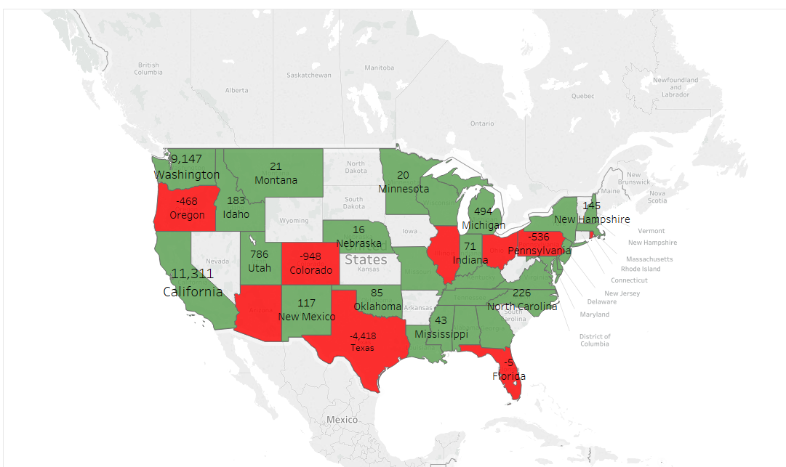
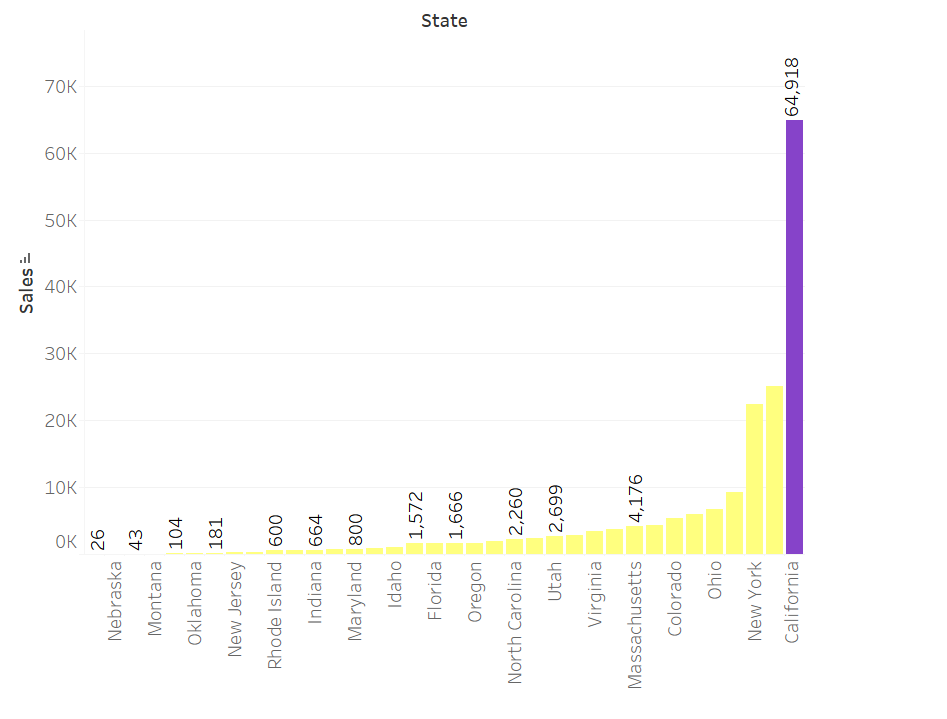
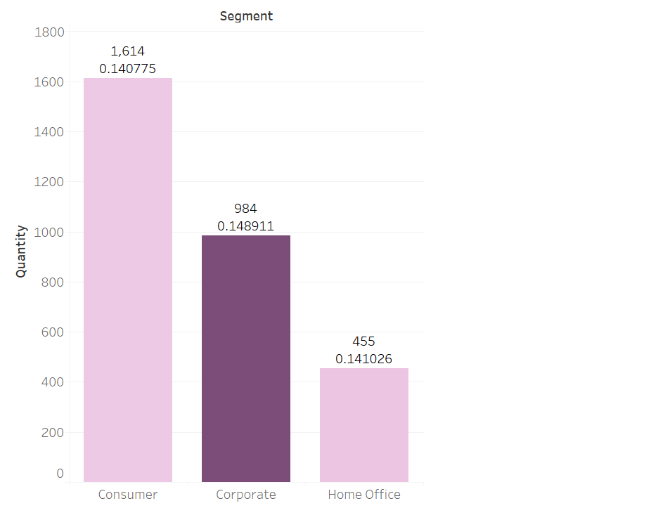
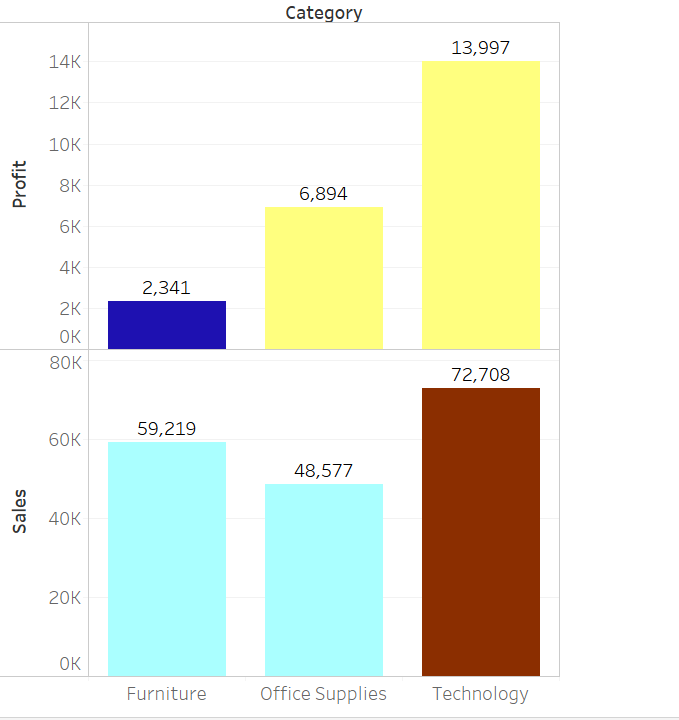
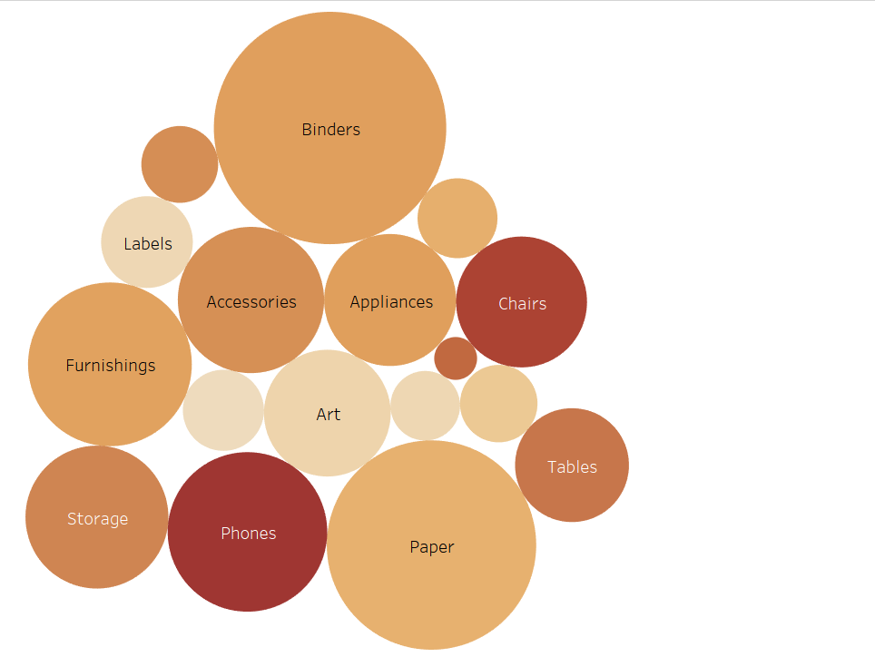

# Tableau-Dashboard-for-OfficeSupplies-Dataset

A project to learn usage of Tableau where the Visualization of Dataset of Office-Supplies was 
done using Tableau Dashboard was done to understand and visualize 5 business scenarios:

[Tableau Dashboard](https://public.tableau.com/profile/meghana4905#!/vizhome/Tableau-Dashboard-for-OfficeSupplies-Dataset/TableauAssignment5)

1. To understand which states have lost money? (Represent Profitable states with Green and Non-Profitable with Red)

2. State with highest sales?

3. Customer Segment with highest order quantity and average discount?

4. Product Category with highest total sales and worst Profit?

5. Subcategory with sales and quantity?

